<div align="center">

<picture>
  <source media="(prefers-color-scheme: dark)" srcset="./assets/hero-dark.svg">
  <source media="(prefers-color-scheme: light)" srcset="./assets/hero-light.svg">
  
</picture>

<br />

<a href="https://blog.negentropy.studio">
  
</a>

<p>
  <a href="https://blog.negentropy.studio">
    
  </a>
  <a href="mailto:w3lt@negentropy.studio">
    
  </a>
  <a href="https://www.linkedin.com/in/tien-duy-pham-603022191/">
    
  </a>
  <a href="https://discordapp.com/users/866989139195199508">
    
  </a>
</p>

</div>

```txt
w3lt@github
├─ role     front-end developer @ The QA Company
├─ studies  INSA Centre Val de Loire — Bourges, France
├─ focus    React / TypeScript / Rust / AI tooling / dev infra
└─ mode     terminal-first, product-minded, anti-entropy
```

### stack

<p align="center">
  
</p>

### featured

<table>
<tr>
<td>

#### · [blog.negentropy.studio](https://blog.negentropy.studio)

Personal organization blog — terminal-themed notes on tech, systems, and reducing entropy in how we build and learn.

<sub>Astro · React · Tailwind · writing on engineering &amp; tooling</sub>

<a href="https://blog.negentropy.studio"><b>read the blog →</b></a>

</td>
</tr>
</table>

### activity

<p align="center">
  
  
</p>

<!--
  Contribution snake — the SVGs below are generated by .github/workflows/profile-assets.yml.
  They will 404 until you run that workflow once (Actions tab → "profile assets" → Run workflow).
-->
<div align="center">
<picture>
  <source media="(prefers-color-scheme: dark)" srcset="./assets/github-snake-dark.svg">
  <source media="(prefers-color-scheme: light)" srcset="./assets/github-snake.svg">
  
</picture>
</div>
